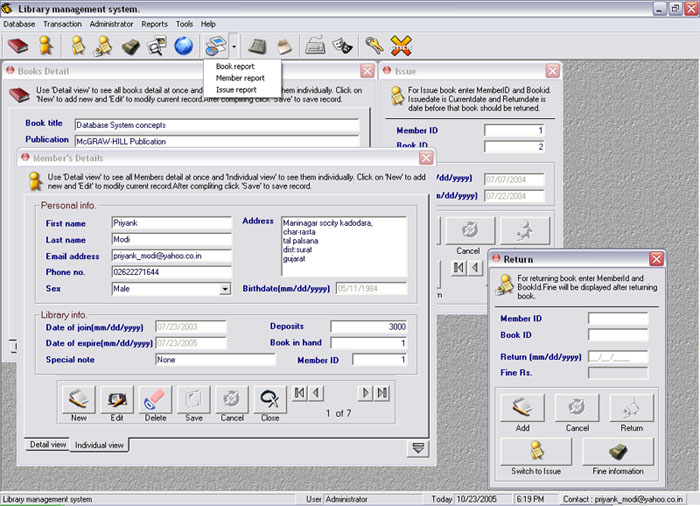



## Library management system ver 2\.0 \(Updated\)

### Description

Don't just judge its cool or not!!!Its really amazing application with professional touch. Learn VB with database also including impressive interface design. See screenshot for more and download applications... and ya don't forget to give your feedback to me at my mail address.

Visite : http://geocities/priyank_modi/
 
### More Info
 

             |
---                |---
**Submitted On**   |2005-10-23 18:30:22
**By**             |[Priyank Modi](https://github.com/Planet-Source-Code/PSCIndex/blob/master/ByAuthor/priyank-modi.md)
**Level**          |Intermediate
**User Rating**    |5.0 (139 globes from 28 users)
**Compatibility**  |VB 6\.0
**Category**       |[Databases/ Data Access/ DAO/ ADO](https://github.com/Planet-Source-Code/PSCIndex/blob/master/ByCategory/databases-data-access-dao-ado__1-6.md)
**World**          |[Visual Basic](https://github.com/Planet-Source-Code/PSCIndex/blob/master/ByWorld/visual-basic.md)
**Archive File**   |[Library\_ma19426610232005\.zip](https://github.com/Planet-Source-Code/priyank-modi-library-management-system-ver-2-0-updated__1-62998/archive/master.zip)

